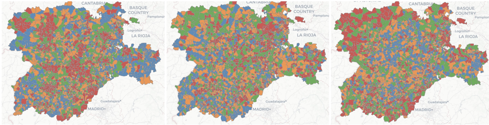

```{r paquetes, warning=FALSE, message=FALSE, echo=FALSE, include=FALSE}
# devtools::install_github("dmurdoch/leaflet@crosstalk4")
library(tidyverse)
library(sf)
library(crosstalk)
library(leaflet)
library(DT)
library(d3scatter)
library(openxlsx)
library(dplyr)
library(parzer)
```


```{r leerdatos, warning=FALSE,message=FALSE,echo=FALSE,include=FALSE, cache=TRUE}
cyl.t <- st_read("Datos/limites-municipales-de-castilla-y-leon-recintos.shp",quiet=TRUE)
cyl.t$codmun <- paste0(cyl.t$c_prov_id,cyl.t$c_muni_id)
cyl.t <- cyl.t[,c(8,3,4,7)]
names(cyl.t)[3] <- "Munic"
pob <- st_read("Datos/registro-de-municipios-de-castilla-y-leon.shp",quiet=TRUE) |> st_drop_geometry()
pob$cod_ine <- paste0(pob$cod_provinc,pob$cod_municip)
cyl.t <- merge(cyl.t,pob[,c("cod_ine","poblacion")],by.x="codmun",by.y="cod_ine",all.y=TRUE)
cyl.t$poblacion <- as.numeric(cyl.t$poblacion)
cyl.t <- cyl.t[,c(2,1,3,4,5)]
rm(pob)
load("~/Dropbox/varios/ProyectoPrensa/CyL/Datos/cochesCyL3.RData")
# Vehículos
coches.cyl.n <- coches.cyl %>% group_by(cine) %>% 
  summarize(n.vehic=n(),
            co2=sum(co2,na.rm = TRUE))
cyl.t <- merge(cyl.t,coches.cyl.n,by.x="codmun",by.y="cine",all.x=TRUE)
cyl.t$n[is.na(cyl.t$n.vehic)] <- 0
cyl.t$co2[is.na(cyl.t$co2)] <- 0
cyl.t$cochespc <- round(cyl.t$n*100/cyl.t$poblacion,1)
# CO2 por habitante
cyl.t$co2ph <- round(cyl.t$co2/cyl.t$poblacion,2)
cyl.t$lco2ph <- round(log(1+cyl.t$co2/(cyl.t$poblacion+1)),2)
# CO2 por vehículo
cyl.t$co2pc <- round(cyl.t$co2/cyl.t$n,2)
cyl.t$lco2pc <- round(log(1+cyl.t$co2/(cyl.t$n+1)),2)
# CO2 por Km2
cyl.t$lco2m2 <- round(log(1+cyl.t$co2*1000000/(cyl.t$superf)),2)
cyl.t$co2m2 <- round(cyl.t$co2*1000000/cyl.t$superf,1)
# Renta
renta <- read.xlsx("Datos/Renta municipios 2021 CyL.xlsx")
cyl.t <- merge(cyl.t,renta[,c(1:3)],by.x="codmun",by.y="CINE",all.x=TRUE)
cyl.t$R1 <- as.numeric(cyl.t$R1)
cyl.t <- cyl.t[,c("provincia","Munic","poblacion","n.vehic","cochespc","co2","co2pc","co2m2","co2ph","R1","lco2pc","lco2m2","lco2ph")]
rm(coches.cyl,renta)
```

```{r estaciones calidad aire, warning=FALSE}
estaciones <- read.xlsx("Datos/estaciones-de-control-de-la-calidad-del-aire.xlsx")
estaciones$OPERATIVA[estaciones$OPERATIVA=="NO"] <- "No"
estaciones$OPERATIVA[estaciones$OPERATIVA=="SI"] <- "Si"
estaciones$lat <- parse_llstr(estaciones$LATITUD)[,1]
estaciones$lon <- -parse_llstr(estaciones$LONGITUD)[,1]
estaciones$lat[2] <- 40.66468145652158
estaciones$lon[2] <- -4.701058608245292
estaciones <- st_as_sf(estaciones, coords = c("lon","lat"), remove=FALSE,crs = 32630) 
sd.estac <-  SharedData$new(estaciones)
# sd.estac_df <- SharedData$new(sd.estac@data, group = sd.estac$groupName())
```


Introducción
===================================== 

<style type="text/css">
  body{
  font-size: 14pt;
  text-align: justify
}
</style>
<br>
<center>
<p style="width: 700px; max-width: 70%; margin: 0 auto;">
<b><span style="color: #1f77b4; font-size: 24pt;">
La Huella de Carbono Generada por Vehículos en los Municipios de Castilla y León</span>
</b>
</p>
</center>
<br>
<center>
{width=40%}
</center>
<p style="width: 700px; max-width: 70%; margin: 0 auto;">
**Resumen:** Esta aplicación web permite visualizar la huella de carbono generada por los vehículos en cada uno de los municipio de Castilla y León. La aplicación integra una base de datos que recopila información sobre el número de vehículos matriculados y las emisiones globales de CO2 asociadas al parque automovilístico a nivel municipal. Esta herramienta es de ayuda para la planificación de políticas ambientales, ya que permite identificar los municipios con los mayores niveles de contaminación asociada al tráfico, facilitando el diseño de estrategias personalizadas para la reducción de emisiones, como la promoción de vehículos eléctricos, la mejora del transporte público o la implementación de zonas de bajas emisiones. 
</p>
<br>
<p style="width: 700px; max-width: 70%; margin: 0 auto;">
   La web incluye las estaciones de control de la calidad del aire. Al proporcionar información visual y detallada, la aplicación permite a los responsables locales tomar decisiones más informadas y crear conciencia entre los ciudadanos sobre la importancia de reducir la huella de carbono para mitigar el cambio climático y mejorar la calidad del aire en sus comunidades.
</p>
<br>


CO2 por Km2
===================================== 

```{r setup, include = FALSE, cache=TRUE}
xx <- cyl.t$co2m2
q <- quantile(xx,na.rm = TRUE)
cyl.t$color <- as.factor((xx > q[2]) + (xx > q[3]) +(xx>= q[4]) + 1)
cyl.t$color <- as.factor(cyl.t$color)
cyl.t$color[is.na(cyl.t$color)] <- "2"
q <- round(q,1)
cyl.t.sp <- cyl.t %>% as('Spatial')
##
# world <- cyl.t.sp
sd <-  SharedData$new(cyl.t.sp)
sd_df <- SharedData$new(cyl.t.sp@data, group = sd$groupName())
```

Inputs {.sidebar}
-----------------------------------------------------------------------

```{r}
filter_select("Municipio", "Selecciona municipio", sd_df, ~Munic)
filter_select("Provincia", "Selecciona provincia", sd_df, ~provincia)
filter_slider("Renta media por persona", "Renta", sd_df, ~R1)
filter_slider("CO2 por Kilómetro cuadrado", "CO2 por Kilómetro cuadrado", sd_df, ~co2m2)
```

---

<b><span style="color: #1f77b4; font-size: 10pt; line-height: 50%;">Indicador de la densidad de contaminación en áreas específicas. Esta variable permite identificar zonas con alta presión de vehículos y evaluar el impacto ambiental por unidad de área.</span></b>


Row {data-height=650}
-------------------------------------

###

```{r leaflet km2, cache=TRUE}
pal <- colorFactor(c("#1f77b4", "#ff7f0e", "#2ca02c", "#d62728"), domain = c("1", "2", "3", "4"), ordered = TRUE)
colors.est <- c("white","black") # ,"#9467bd"
pal2 <- colorFactor(colors.est, domain = c("No", "Si"), ordered = TRUE)
mypopup <- paste("<b>Municipio:</b>",cyl.t$Munic,"<br>",
                 "<b>Población:</b>",cyl.t$poblacion,"<br>",
                 "<b>Renta media:</b>",cyl.t$R1,"<br>",
                 "<b>Total vehículos:</b>",cyl.t$n.vehic,"<br>",
                 "<b>Coches por 100 hab:</b>",cyl.t$cochespc,"<br>",
                 "<b>CO2 Total:</b>",cyl.t$co2,"<br>",
                 "<b>CO2 por hab.:</b>",cyl.t$co2ph,"<br>",
                 "<b>CO2 por vehíc.:</b>",cyl.t$co2pc,"<br>",
                 "<b>CO2 por Km2:</b>",cyl.t$co2m2,"<br>")
mypopup.est <- paste("<b>Estación:</b>",estaciones$ESTACIÓN,"<br>",
                 "<b>Localización:</b>",estaciones$LOCALIZACIÓN,"<br>",
                 "<b>Provincia:</b>",estaciones$PROVINCIA,"<br>",
                 "<b>Altitud:</b>",estaciones$ALTITUD,"<br>",
                 "<b>Operativa:</b>",estaciones$OPERATIVA,"<br>")
leaflet(sd) %>% 
  setView(-4.73865, 41.6485, zoom = 7) %>%
  addProviderTiles("CartoDB.Positron") %>% 
  addPolygons(data = cyl.t, color = "#969696", weight = 1.5, fillColor = "#e0e0e0") %>%
  addPolygons(color = "#969696", weight = 1.5, fillColor = ~pal(color), fillOpacity = 0.8,
              label = ~ paste("Municipio:",cyl.t$Munic),
              popup = ~ mypopup) %>%
  addLegend(position = "topright",colors = c("#1f77b4", "#ff7f0e", "#2ca02c", "#d62728"),
            labels = c(paste0("Menos de ",q[2]),paste0(q[2]," - ",q[3]),paste0(q[3]," - ",q[4]),paste0("Más de ",q[4])),
            title = "Emisiones de <br> CO2 por Km2",
            opacity = 1) %>%
  addCircleMarkers(data=estaciones, ~lon , ~lat, radius=2, color = pal2(estaciones$OPERATIVA),
                   label = estaciones$ESTACIÓN,
                   popup = ~ mypopup.est) %>%
  addLegend(position = "topright",colors = colors.est ,opacity = 1,
                   labels = c("No", "Si"),title = "Estaciones <br> Calidad Aire <br> Operativa") %>%
  addScaleBar(position = "bottomleft")
```

Row {data-height=350}
-------------------------------------

###

```{r, cache=TRUE}
d3scatter(sd_df, x = ~lco2m2, color = ~color, y = ~R1,  x_label = "CO2 por Km2 (en logaritmos)", y_label = "Renta media")
```

###

```{r, cache=TRUE}
datatable(sd_df, rownames = FALSE, extensions = 'Scroller',
         options = list(scrollY = 200, scroller = TRUE, columnDefs = list(list(className = 'dt-left', targets = 0:3))))
```


CO2 por hab
===================================== 

```{r setup2, include = FALSE, cache=TRUE}
xx <- cyl.t$co2ph
q <- quantile(xx,na.rm = TRUE)
cyl.t$color <- as.factor((xx > q[2]) + (xx > q[3]) + (xx>= q[4]) + 1)
# cyl.t$color[is.na(cyl.t$color)] <- "2"
q <- round(q,1)
cyl.t.sp <- cyl.t %>% as('Spatial')
sd <-  SharedData$new(cyl.t.sp)
sd_df <- SharedData$new(cyl.t.sp@data, group = sd$groupName())
```

Inputs {.sidebar}
-----------------------------------------------------------------------

```{r}
filter_select("Municipio", "Selecciona municipio", sd_df, ~Munic)
filter_select("Provincia", "Selecciona provincia", sd_df, ~provincia)
filter_slider("Renta media por persona", "Renta", sd_df, ~R1)
filter_slider("CO2 por habitante", "CO2 por habitante", sd_df, ~lco2ph)
```

---

<b><span style="color: #1f77b4; font-size: 10pt; line-height: 1;">Indicador del impacto sobre el individuo en la contaminación del aire. Esta métrica ayuda a comparar municipios con diferentes densidades poblacionales y niveles de desarrollo. Un municipio con una alta emisión de CO2 por habitante puede indicar una dependencia excesiva del transporte privado o una falta de alternativas de movilidad sostenible.</span></b>


Row {data-height=650}
-------------------------------------

###

```{r leaflet hab, cache=TRUE}
leaflet(sd) %>% 
  setView(-4.73865, 41.6485, zoom = 7) %>%
  addProviderTiles("CartoDB.Positron") %>% 
  addPolygons(data = cyl.t, color = "#969696", weight = 1.5, fillColor = "#808080") %>%
  addPolygons(color = "#969696", weight = 1.5, fillColor = ~pal(color), fillOpacity = 0.8,
              label = ~ paste("Municipio:",Munic),
                              popup = ~ mypopup) %>%
addLegend(position = "topright", 
            colors = c("#1f77b4", "#ff7f0e", "#2ca02c", "#d62728"),
            labels = c(paste0("Menos de ",q[2]),paste0(q[2]," - ",q[3]),paste0(q[3]," - ",q[4]),paste0("Más de ",q[4])),
            title = "Emisiones de <br> CO2 por 100 hab",
            opacity = 1) %>%
  addCircleMarkers(data=estaciones, ~lon , ~lat, radius=2, color = pal2(estaciones$OPERATIVA),
                   label = estaciones$ESTACIÓN,
                   popup = ~ mypopup.est) %>%
  addLegend(position = "topright",colors = colors.est,opacity = 1,
                   labels = c("Si", "No"),title = "Estaciones <br> Calidad Aire <br> Operativa") %>%
  addScaleBar(position = "bottomleft")
```

Row {data-height=350}
-------------------------------------

###

```{r, cache=TRUE}
d3scatter(sd_df, x = ~lco2ph, color = ~color, y = ~R1,  x_label = "CO2 por hab (en logaritmos)", y_label = "Renta media")
```

###

```{r, cache=TRUE}
datatable(sd_df, rownames = FALSE, extensions = 'Scroller',
         options = list(scrollY = 200, scroller = TRUE, columnDefs = list(list(className = 'dt-left', targets = 0:3))))
```

CO2 por vehículo
===================================== 

```{r setup3, include = FALSE}
xx <- cyl.t$co2pc
q <- quantile(xx,na.rm = TRUE)
cyl.t$color <- as.factor((xx > q[2]) + (xx > q[3]) + (xx>= q[4]) + 1)
cyl.t$color <- as.factor(cyl.t$color)
cyl.t$color[is.na(cyl.t$color)] <- "2"
q <- round(q,1)
cyl.t.sp <- cyl.t %>% as('Spatial')
##
sd <-  SharedData$new(cyl.t.sp)
sd_df <- SharedData$new(cyl.t.sp@data, group = sd$groupName())
```

Inputs {.sidebar}
-----------------------------------------------------------------------

```{r}
filter_select("Municipio", "Selecciona municipio", sd_df, ~Munic)
filter_select("Provincia", "Selecciona provincia", sd_df, ~provincia)
filter_slider("Renta media por persona", "Renta", sd_df, ~R1)
filter_slider("CO2 por vehículo", "CO2 por vehículo", sd_df, ~co2pc)
```

---

<b><span style="color: #1f77b4; font-size: 10pt; line-height: 1;">Indicador del tipo de vehículo predominante y su eficiencia energética. Un municipio con una media elevada de emisiones por vehículo puede indicar una mayor proporción de automóviles antiguos o menos eficientes.</span></b>


Row {data-height=650}
-------------------------------------

###

```{r leaflet vehiculos, cache=TRUE}
leaflet(sd) %>% 
  setView(-4.73865, 41.6485, zoom = 7) %>%
  addProviderTiles("CartoDB.Positron") %>% 
  addPolygons(data = cyl.t, color = "#969696", weight = 1.5, fillColor = "#808080") %>%
  addPolygons(color = "#969696", weight = 1.5, fillColor = ~pal(color), fillOpacity = 0.8,
              label = ~ paste("Municipio:",Munic),
                              popup = ~ mypopup) %>%
addLegend(position = "topright", 
            colors = c("#1f77b4", "#ff7f0e", "#2ca02c", "#d62728"),
            labels = c(paste0("Menos de ",q[2]),paste0(q[2]," - ",q[3]),paste0(q[3]," - ",q[4]),paste0("Más de ",q[4])),
            title = "Emisiones de <br> CO2 por vehículo",
            opacity = 1) %>%
  addCircleMarkers(data=estaciones, ~lon , ~lat, radius=2, color = pal2(estaciones$OPERATIVA),
                   label = estaciones$ESTACIÓN,
                   popup = ~ mypopup.est) %>%
  addLegend(position = "topright",colors = colors.est ,opacity = 1,
                   labels = c("Si","No"),title = "Estaciones <br> Calidad Aire <br> Operativa") %>%
  addScaleBar(position = "bottomleft")
```

Row {data-height=350}
-------------------------------------

###

```{r, cache=TRUE}
d3scatter(sd_df, x = ~co2pc, color = ~color, y = ~R1,  x_label = "CO2 por vehículo (en logaritmos)", y_label = "Renta media")
```

###

```{r, cache=TRUE}
datatable(sd_df, rownames = FALSE, extensions = 'Scroller',
         options = list(scrollY = 200, scroller = TRUE, columnDefs = list(list(className = 'dt-left', targets = 0:3))))
```


Datos y Metodología
===================================== 

<center>
<b><span style="color: #1f77b4; font-size: 20pt;">La Huella de Carbono Generada por Vehículos en los Municipios de Castilla y León</span></b>

<b><span style="color: #1f77b4; font-size: 16pt;">Proyecto presentado para el VIII Concurso de Datos Abiertos de la Junta de Castilla y León</span></b>

Fernando Antonio López Hernández
Catedrático Universidad
Universidad Politécnica de Cartagena

</center>

**Datos:**
Se han utilizado dos conjuntos de datos del portal de datos abiertos de CyL

1. Cartografía municipal (limites-municipales-de-castilla-y-leon-recintos.shp)
2. Datos de población (registro-de-municipios-de-castilla-y-leon.shp)
3. Estaciones de Calidad del Aire (estaciones-de-control-de-la-calidad-del-aire.xlsx)

Esta información ha sido linkada con dos conjuntos de datos externos:

4. La base de datos de la Dirección General de Tráfico (DGT) que detalla las matriculaciones de vehículos junto con sus características técnicas. Se consideran todos los vehículos matriculados en el periodo de 9 años entre 2015 y 2023 (no hay información anterior a 2015). La base de datos está disponible en abierto en el portal web de la [DGT en cifras](https://www.dgt.es/menusecundario/dgt-en-cifras/).

5. Renta media por municipio (2021) publicada por Instituto Nacional de Estadística (INE). Estadísticas experimentales. 


**CO2 emitido**

La base de datos de la DGT indica para cada uno de los vehículos matriculados la emisión de CO2 (en gramos por kilómetro) que aparece en la ficha técnica del vehículo emitida por la ITV.

Para cada uno de los 2.298 municipios de Castilla y León se han agregado todas las emisiones de CO2 del total de vehículos domiciliados en el municipio. 

Por ejemplo, para el municipio de *Torres del Carrizal* la DGT contabiliza XX vehículos matriculados cuya suma de los valores de CO2 que aparecen en la ficha técnica es XX

Esta cantidad se ha relativizado en función de tres variables.

* **Emisiones de CO2 por superficie del municipio**

Indicador de la densidad de contaminación en áreas específicas. Esta variable permite identificar zonas con alta presión de vehículos y evaluar el impacto ambiental por unidad de área.

_**CO2 por Km:**_ Suma de las emisiones de CO2 (por 1,000.000) entre la superficie (Km2) del municipio

* **Emisiones de CO2 por número de habitantes**

Indicador del impacto sobre el individuo en la contaminación del aire. Esta métrica ayuda a comparar municipios con diferentes densidades poblacionales y niveles de desarrollo. Un municipio con una alta emisión de CO2 por habitante puede indicar una dependencia excesiva del transporte privado o una falta de alternativas de movilidad sostenible

_**CO2 por hab:**_ Suma de las emisiones de CO2 entre el número de habitantes del municipio

* **Media de las emisiones de CO2 por vehículo**

Indicador del tipo de vehículos predominantes y su eficiencia energética. Un municipio con una media elevada de emisiones por vehículo puede indicar una mayor proporción de automóviles antiguos o menos eficientes, lo que proporciona datos valiosos para promover políticas de renovación del parque de vehículos, incentivar vehículos eléctricos y mejorar la planificación del transporte sostenible.

_**CO2 por vehículo:**_ Suma de las emisiones de CO2 entre el número de vehículos domiciliados en el municipio

* **Otras variables**

_**Renta media en euros**

_**Coches por 100 habitantes**

**Metodología**

En este artículo se analizan las ventas de más de 440.000 vehículos en los últimos 9 años domiciliados en algún municipio de Castilla y León. Todos los datos utilizados en este artículo están disponibles en abierto en el portal estadístico de la DGT. Los datos de renta per cápita se obtuvieron de la sección de estadísticas experimentales del Instituto Nacional de Estadística (INE). Se descargaron los ficheros con microdatos y se procesaron con el software libre R. El paquete leaflet [@leaflet] fue usado para generar los mapas con la cartografía disponible en el portal de datos abiertos de CyL. Los paquetes crosstalk [@crosstalk] y flexdashboard [@flexdashboard] fueron usados para elaborar el panel web.

**Reproducibilidad**

Toda la investigación se ha llevado a cabo siguiendo estrictamente el principio de reproducibilidad, lo que garantiza que los resultados puedan ser verificados y replicados por otros investigadores. Para cumplir con este estándar, se proporciona acceso completo a los datos abiertos utilizados en la investigación y se ha puesto a disposición el código empleado en el análisis en formato RMarkdown. Todo este material está accesible en nuestro repositorio de GitHub, lo que facilita no solo la transparencia y la validación independiente de los resultados, sino también la posibilidad de que otros puedan reutilizar y adaptar estos recursos para investigaciones futuras o para mejorar metodologías existentes.

https://github.com/f8l5h9/CyL

**References**

